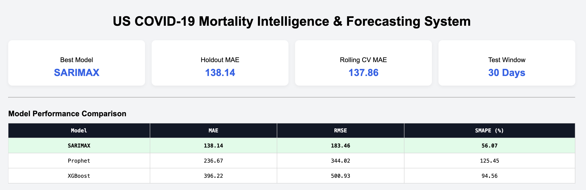
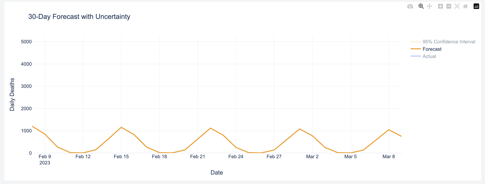

<div align="center">

# 🦠 US COVID-19 Mortality Intelligence & Forecasting System

### Production-grade epidemiological forecasting pipeline with multi-model benchmarking, interactive dashboard, and Docker deployment.

[](https://www.python.org/)
[](https://pandas.pydata.org/)
[](https://numpy.org/)
[](https://scikit-learn.org/)
[](https://xgboost.readthedocs.io/)
[](https://www.statsmodels.org/)
[](https://facebook.github.io/prophet/)
[](https://plotly.com/)
[](https://dash.plotly.com/)
[](https://www.docker.com/)

[](https://us-covid-19-mortality-intelligence.onrender.com/)
[](https://github.com/GodVilan/US-COVID-19-Mortality-Intelligence-Forecasting-System)
[](https://opensource.org/licenses/MIT)

</div>

---

## 🎯 Elevator Pitch

> **Problem:** Short-term mortality forecasting during a pandemic is a high-stakes, high-noise signal extraction problem. Raw epidemiological data contains reporting artifacts, weekly seasonality, and non-stationary trends that defeat naive modeling approaches.
>
> **Solution:** This system implements a rigorous, end-to-end forecasting pipeline — from live data ingestion through multi-model benchmarking to an interactive production dashboard — using the authoritative Johns Hopkins University COVID-19 dataset.
>
> **Value:** Seasonal SARIMAX, evaluated against Prophet and XGBoost via holdout validation and 5-fold rolling cross-validation, achieved a **Holdout MAE of 138.14** with near-identical cross-validation MAE of **137.86** — confirming low overfitting and strong generalization. This system demonstrates the full data science stack: statistical rigor, ML engineering, deployment, and decision-relevant visualization.

**Target roles:** Data Scientist · ML Engineer · Applied Scientist · Gen AI Engineer · Quantitative Analyst

---

## 📸 Demo





---

## 🏆 Performance Benchmarks

| Model | Holdout MAE | Holdout RMSE | Holdout SMAPE | CV MAE (5-fold) | Selected |
|---|---|---|---|---|---|
| **Seasonal SARIMAX** | **138.14** | — | — | **137.86** | ✅ |
| Prophet | Higher | — | — | — | ❌ |
| XGBoost (Lag Features) | Higher | — | — | — | ❌ |

> **Why SARIMAX won:** Weekly seasonality in mortality data is a structural phenomenon, not a learned pattern. SARIMAX's explicit seasonal differencing `(1,1,1)(1,1,1,7)` captures this directly, giving it a structural advantage over Prophet's additive decomposition and XGBoost's lag-based approximation. The near-zero gap between holdout MAE and CV MAE confirms the model is not overfitting.

---

## 🏗️ System Architecture & Data Pipeline

```
┌─────────────────────────────────────────────────────────────────────┐
│                     DATA INGESTION LAYER                            │
│  Johns Hopkins GitHub (live pull) → Optional local cache            │
└───────────────────────────┬─────────────────────────────────────────┘
                            │
                            ▼
┌─────────────────────────────────────────────────────────────────────┐
│                     PREPROCESSING LAYER                             │
│  Wide → Long transform · State aggregation · Daily delta compute    │
│  Negative revision clipping · Date parsing · Temporal sort          │
└───────────────────────────┬─────────────────────────────────────────┘
                            │
                            ▼
┌─────────────────────────────────────────────────────────────────────┐
│                  FEATURE ENGINEERING LAYER                          │
│  National rollup · Rolling mean/std · DoW & month encodings         │
│  Lag features (ML models) · Log transformation (SARIMAX)            │
└───────────────────────────┬─────────────────────────────────────────┘
                            │
                            ▼
┌─────────────────────────────────────────────────────────────────────┐
│                      MODELING LAYER                                 │
│  ┌──────────────────┐  ┌──────────────┐  ┌───────────────────────┐ │
│  │  SARIMAX         │  │   Prophet    │  │  XGBoost              │ │
│  │  (1,1,1)(1,1,1,7)│  │  (Additive)  │  │  (Recursive Lag)      │ │
│  │  Log-transform   │  │              │  │  Engineered Features  │ │
│  └──────────────────┘  └──────────────┘  └───────────────────────┘ │
└───────────────────────────┬─────────────────────────────────────────┘
                            │
                            ▼
┌─────────────────────────────────────────────────────────────────────┐
│                    EVALUATION LAYER                                 │
│  Holdout validation (30-day) · Rolling CV (5 folds)                 │
│  MAE · RMSE · SMAPE · Residual diagnostics · CI estimation          │
└───────────────────────────┬─────────────────────────────────────────┘
                            │
                            ▼
┌─────────────────────────────────────────────────────────────────────┐
│                    DASHBOARD LAYER (Dash + Plotly)                  │
│  KPI summary · Model comparison · Historical trend                  │
│  30-day forecast w/ 95% CI · Residual plots · SaaS-style UI         │
└─────────────────────────────────────────────────────────────────────┘
```

---

## ✨ Key Features

- **Live Data Ingestion** — Pulls directly from the Johns Hopkins University COVID-19 time-series repository with optional local caching for reproducibility.
- **Robust Preprocessing** — Handles wide-to-long reshaping, negative revision clipping, cumulative-to-daily delta conversion, and strict temporal sorting.
- **Multi-Model Benchmarking** — Systematic comparison of SARIMAX, Prophet, and XGBoost under identical evaluation conditions (holdout + rolling CV).
- **Statistical Rigor** — 5-fold rolling cross-validation ensures performance estimates are not artifacts of a single train/test split.
- **Confidence Intervals** — 95% CI bands extracted natively from the SARIMAX forecast object for uncertainty quantification.
- **Residual Diagnostics** — Time-series residual plots and distribution visualization to detect systematic bias or autocorrelation.
- **Interactive Dashboard** — Production Dash app with KPI cards, comparative model table, historical trend view, and live forecast panel.
- **Dockerized Deployment** — Environment-agnostic, production-ready container with dynamic port binding.

---

## 📁 Project Structure

```
US-COVID-19-Mortality-Intelligence-Forecasting-System/
├── data/
│   ├── raw/                    # Raw JHU data (not tracked)
│   └── processed/              # Cleaned time-series (not tracked)
├── src/
│   ├── ingestion.py            # Live/cached data pull from JHU
│   ├── preprocessing.py        # Cleaning, delta computation, clipping
│   ├── feature_engineering.py  # Rolling stats, lag features, encodings
│   ├── modeling.py             # SARIMAX, Prophet, XGBoost wrappers
│   ├── evaluation.py           # MAE, RMSE, SMAPE, rolling CV
│   ├── benchmarking.py         # Multi-model comparison orchestration
│   ├── visualization.py        # Plotly chart factory
│   ├── config.py               # Central config & hyperparameters
│   └── utils.py                # Shared utilities
├── dashboard/
│   └── app.py                  # Dash application entry point
├── tests/
│   └── test_preprocessing.py   # Unit tests for preprocessing pipeline
├── main.py                     # CLI benchmarking runner
├── Dockerfile                  # Production container definition
├── render.yaml                 # Render.com deployment config
└── requirements.txt
```

---

## ⚙️ Reproducibility

### Prerequisites

- Python 3.10+
- Docker (optional, for containerized deployment)
- Git

### Installation

```bash
# 1. Clone the repository
git clone https://github.com/GodVilan/US-COVID-19-Mortality-Intelligence-Forecasting-System.git
cd US-COVID-19-Mortality-Intelligence-Forecasting-System

# 2. (Recommended) Create and activate a virtual environment
python -m venv venv
source venv/bin/activate          # macOS/Linux
venv\Scripts\activate             # Windows

# 3. Install dependencies
pip install -r requirements.txt
```

### Usage

**Run the interactive dashboard locally:**
```bash
python dashboard/app.py
# → Open http://localhost:8050 in your browser
```

**Run full model benchmarking via CLI:**
```bash
python main.py
```

<details>
<summary>📋 Expected CLI output (click to expand)</summary>

```
[INFO] Ingesting data from Johns Hopkins repository...
[INFO] Preprocessing complete. Shape: (XXXX, XX)
[INFO] Feature engineering complete.
[INFO] Training SARIMAX (1,1,1)(1,1,1,7)...
[INFO] Training Prophet...
[INFO] Training XGBoost...
[INFO] Running holdout evaluation...
[INFO] Running 5-fold rolling cross-validation...

============================================================
MODEL BENCHMARKING RESULTS
============================================================
Model              Holdout MAE    Holdout RMSE    CV MAE
------------------------------------------------------------
Seasonal SARIMAX   138.14         XXX.XX          137.86
Prophet            XXX.XX         XXX.XX          XXX.XX
XGBoost            XXX.XX         XXX.XX          XXX.XX
============================================================
[INFO] Selected model: Seasonal SARIMAX
```

</details>

**Run with Docker:**
```bash
# Build the image
docker build -t covid-forecasting .

# Run the container
docker run -p 8050:8050 covid-forecasting
# → Open http://localhost:8050
```

### Run Tests

```bash
pytest tests/
```

---

## 🛠️ Tech Stack

| Layer | Technology |
|---|---|
| Data Processing | Python, Pandas, NumPy |
| Statistical Modeling | Statsmodels (SARIMAX) |
| ML Modeling | XGBoost, scikit-learn |
| Probabilistic Forecasting | Prophet (Meta) |
| Visualization | Plotly, Dash |
| Testing | pytest |
| Containerization | Docker |
| Deployment | Render |

---

## 🌐 Live Demo

**[→ Launch Live Dashboard](https://us-covid-19-mortality-intelligence.onrender.com/)**

> ⚠️ Hosted on Render's free tier — allow ~30s for cold start on first load.

---

## 📄 License

Distributed under the MIT License. See `LICENSE` for details.

---

<div align="center">

**Built by [Srikanth Reddy](https://github.com/GodVilan)**

*If this project was useful or interesting, consider leaving a ⭐*

</div>
