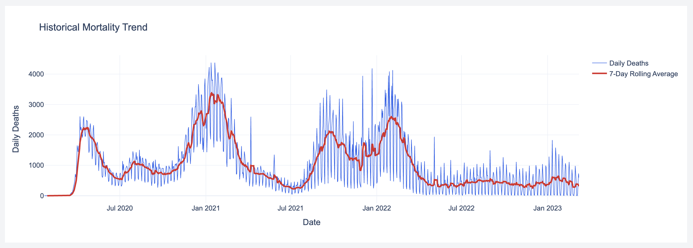

# US COVID-19 Mortality Intelligence & Forecasting System


---

## 🚀 Elevator Pitch

A production-grade, end-to-end mortality forecasting system built on authoritative Johns Hopkins epidemiological data.  

This project benchmarks **Seasonal SARIMAX, Prophet, and XGBoost** using rigorous holdout validation and rolling cross-validation to determine the most stable short-term forecasting strategy under seasonal epidemiological dynamics.

Instead of blindly applying ML, this system:

- Benchmarks classical statistical and machine learning models  
- Applies log-transformation for variance stabilization  
- Enforces real-world non-negativity constraints  
- Implements rolling cross-validation for robustness validation  
- Quantifies uncertainty using confidence intervals  
- Performs residual diagnostics for statistical validation  

**Result:** Seasonal SARIMAX achieved superior stability and lowest forecasting error.

| Metric | Value |
|--------|--------|
| Holdout MAE | **138.14** |
| Rolling CV MAE | **137.86** |
| Selected Model | **Seasonal SARIMAX (1,1,1)(1,1,1,7)** |

The tight alignment between holdout and cross-validation error confirms model robustness and low overfitting.

This project demonstrates production-level data science maturity — not just modeling, but system design, evaluation discipline, deployment, and interpretability.

---

## 🌐 Live Demo

🔗 GitHub Repository:  
[Repo Link](https://github.com/GodVilan/US-COVID-19-Mortality-Intelligence-Forecasting-System) 

🔗 Live Dashboard:  
[Click Here](https://us-covid-19-mortality-intelligence.onrender.com/)

---

## 🏗️ System Architecture & Data Pipeline

```
┌─────────────────────────────────────────────────────────────────────┐
│                     DATA INGESTION LAYER                            │
│  Johns Hopkins GitHub (live pull) → Optional local cache            │
└───────────────────────────┬─────────────────────────────────────────┘
                            │
                            ▼
┌─────────────────────────────────────────────────────────────────────┐
│                     PREPROCESSING LAYER                             │
│  Wide → Long transform · State aggregation · Daily delta compute    │
│  Negative revision clipping · Date parsing · Temporal sort          │
└───────────────────────────┬─────────────────────────────────────────┘
                            │
                            ▼
┌─────────────────────────────────────────────────────────────────────┐
│                  FEATURE ENGINEERING LAYER                          │
│  National rollup · Rolling mean/std · DoW & month encodings         │
│  Lag features (ML models) · Log transformation (SARIMAX)            │
└───────────────────────────┬─────────────────────────────────────────┘
                            │
                            ▼
┌─────────────────────────────────────────────────────────────────────┐
│                      MODELING LAYER                                 │
│  ┌──────────────────┐  ┌──────────────┐  ┌───────────────────────┐ │
│  │  SARIMAX         │  │   Prophet    │  │  XGBoost              │ │
│  │  (1,1,1)(1,1,1,7)│  │  (Additive)  │  │  (Recursive Lag)      │ │
│  │  Log-transform   │  │              │  │  Engineered Features  │ │
│  └──────────────────┘  └──────────────┘  └───────────────────────┘ │
└───────────────────────────┬─────────────────────────────────────────┘
                            │
                            ▼
┌─────────────────────────────────────────────────────────────────────┐
│                    EVALUATION LAYER                                 │
│  Holdout validation (30-day) · Rolling CV (5 folds)                 │
│  MAE · RMSE · SMAPE · Residual diagnostics · CI estimation          │
└───────────────────────────┬─────────────────────────────────────────┘
                            │
                            ▼
┌─────────────────────────────────────────────────────────────────────┐
│                    DASHBOARD LAYER (Dash + Plotly)                  │
│  KPI summary · Model comparison · Historical trend                  │
│  30-day forecast w/ 95% CI · Residual plots · SaaS-style UI         │
└─────────────────────────────────────────────────────────────────────┘
```

---


### 1️⃣ Data Ingestion
- Live pull from Johns Hopkins time-series dataset
- Optional local caching
- Reproducible loading pipeline

### 2️⃣ Preprocessing
- Wide-to-long transformation
- State-level aggregation
- Daily deaths derived from cumulative counts
- Negative revision clipping
- Explicit datetime parsing

### 3️⃣ Feature Engineering
- National-level aggregation
- 7-day rolling mean & standard deviation
- Temporal encodings (day-of-week, month)
- Lag features for ML models

### 4️⃣ Modeling Layer
- **Seasonal SARIMAX (1,1,1)(1,1,1,7)**
- Prophet
- XGBoost with recursive forecasting
- Log transformation + inverse exponential recovery
- Non-negative forecast enforcement

### 5️⃣ Statistical Validation
- Holdout validation (30-day window)
- Rolling cross-validation (5 folds)
- Confidence intervals from SARIMAX forecast object
- Residual time-series diagnostics
- Residual distribution analysis

### 6️⃣ Deployment
- Dockerized
- Environment-aware port binding
- Cloud deployment on Render

---

## 📊 Key Features

- Multi-model benchmarking framework
- Automated best-model selection
- Rolling cross-validation validation loop
- Log variance stabilization
- Confidence interval visualization
- Residual diagnostics (time-series + distribution)
- Interactive SaaS-style dashboard
- Fully containerized deployment

---

## 📈 Model Benchmarking Results

| Model    | MAE   | RMSE  | SMAPE (%) |
|----------|--------|--------|------------|
| SARIMAX  | **138.14** | **183.46** | **56.07** |
| Prophet  | 208.02 | 304.37 | 116.54 |
| XGBoost  | 396.22 | 500.93 | 94.56 |

### Why SARIMAX Won

- Strong weekly seasonality modeling  
- Stable cross-validation performance  
- Lower volatility sensitivity  
- Structured autoregressive behavior  

This highlights a key industry insight:

> Classical statistical models can outperform ML when domain structure is strong and well-defined.

---

## 🖥 Dashboard Preview

Add screenshots or GIFs here:




---

## 🔁 Reproducibility

### Prerequisites
- Python 3.11+
- pip
- Docker (optional for containerized deployment)

---

### Installation

```bash
# 1. Clone the repository
git clone https://github.com/GodVilan/US-COVID-19-Mortality-Intelligence-Forecasting-System.git
cd US-COVID-19-Mortality-Intelligence-Forecasting-System

# 2. (Recommended) Create and activate a virtual environment
python -m venv venv
source venv/bin/activate          # macOS/Linux
venv\Scripts\activate             # Windows

# 3. Install dependencies
pip install -r requirements.txt
```


### Usage

**Run the interactive dashboard locally:**
```bash
python dashboard/app.py
# → Open http://localhost:8050 in your browser
```

**Run full model benchmarking via CLI:**
```bash
python main.py
```
<details>
<summary>📋 Expected CLI output (click to expand)</summary>

```
[INFO] Ingesting data from Johns Hopkins repository...
[INFO] Preprocessing complete. Shape: (XXXX, XX)
[INFO] Feature engineering complete.
[INFO] Training SARIMAX (1,1,1)(1,1,1,7)...
[INFO] Training Prophet...
[INFO] Training XGBoost...
[INFO] Running holdout evaluation...
[INFO] Running 5-fold rolling cross-validation...

============================================================
MODEL BENCHMARKING RESULTS
============================================================
Model              Holdout MAE    Holdout RMSE    CV MAE
------------------------------------------------------------
Seasonal SARIMAX   138.14         XXX.XX          137.86
Prophet            XXX.XX         XXX.XX          XXX.XX
XGBoost            XXX.XX         XXX.XX          XXX.XX
============================================================
[INFO] Selected model: Seasonal SARIMAX
```

</details>

**Docker Deployment:**
```bash
# Build the image
docker build -t covid-forecasting .

# Run the container
docker run -p 8050:8050 covid-forecasting
# → Open http://localhost:8050
```

### Run Tests

```bash
pytest
```

## 🧠 Engineering Practices Demonstrated

  - Modular architecture
  - Separation of concerns
  - Config-driven design
  - Statistical rigor
  - Cross-validation discipline
  - Production deployment readiness
  - Reproducibility
  - Unit testing
  - Environment-aware configuration

<div align="center">

**Built by [GodVilan](https://github.com/GodVilan)**

*If this project was useful or interesting, consider leaving a ⭐*

</div>